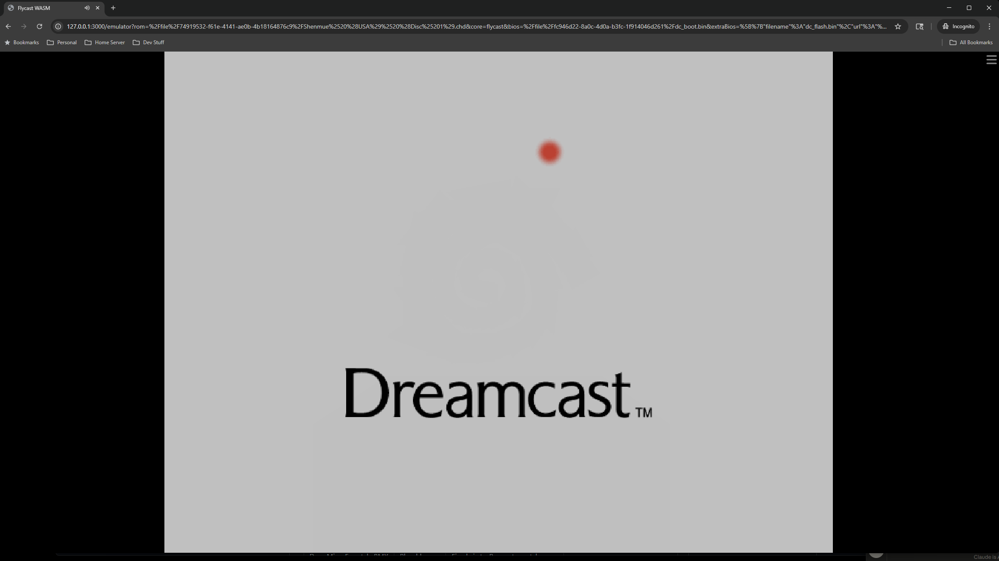
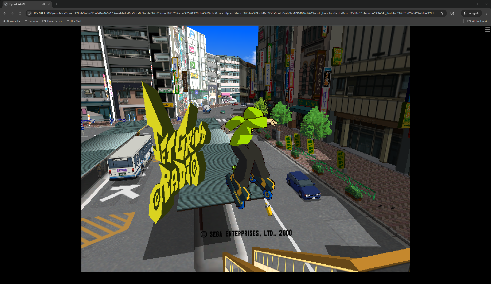
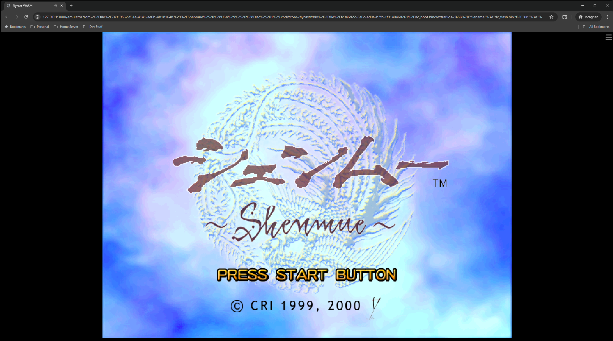

# Flycast WASM

Sega Dreamcast emulation in the browser via WebAssembly.

Flycast compiled to WASM, running as a libretro core inside EmulatorJS. The upstream flyinghead/flycast codebase has been successfully ported using CMake, with an experimental WASM JIT recompiler in active development.

[](https://www.youtube.com/watch?v=VAGoy-kjqYA)

## Status

| Branch | Build | Status |
|--------|-------|--------|
| `main` | v1 (libretro/flycast fork) | Stable. Interpreter only. |
| `upstream-baseline` | Upstream flyinghead/flycast interpreter | Working. Full CMake port. |
| `upstream-interpreter-benchmark` | Optimized interpreter | Working. +37% throughput via ASYNCIFY_REMOVE. |
| `wasm-jit` | WASM JIT recompiler | In progress. SH4 blocks compiled to WASM at runtime. |

Games boot with real BIOS, render via WebGL2, and play with full audio.

<p align="center">
  
  
  
</p>

## Upstream Port

The upstream [flyinghead/flycast](https://github.com/flyinghead/flycast) maintainer [explicitly declined](https://github.com/flyinghead/flycast/issues/1883) WASM support. EmulatorJS does not list Dreamcast as a supported system. The libretro buildbot does not produce Flycast WASM cores.

This repository contains a working port of the upstream codebase to WebAssembly using CMake and Emscripten. The interpreter-only build is on `upstream-baseline`. An optimized variant with ASYNCIFY_REMOVE (removing Asyncify instrumentation from hot functions) is on `upstream-interpreter-benchmark`.

### v1 Build (deprecated)

The original build was based on the deprecated `libretro/flycast` fork, which had a broken but structurally present Emscripten target. Over 30 bugs were fixed across the Makefile, C/C++ source, Emscripten linker, JavaScript runtime, and EmulatorJS integration. See [TECHNICAL_WRITEUP.md](TECHNICAL_WRITEUP.md) for the complete bug reference.

The v1 build remains on `main` for reference but is no longer actively developed.

## WASM JIT

The `wasm-jit` branch contains an experimental dynamic recompiler that compiles SH4 basic blocks to WebAssembly modules at runtime.

Architecture: SH4 machine code -> Flycast decoder -> SHIL IR -> `rec_wasm.cpp` -> WASM bytecode -> `WebAssembly.compile()` -> dispatch via `call_indirect`

Current state:
- 51 of 70 SHIL ops emitted natively in WASM bytecode
- Remaining ops fall back to the SHIL interpreter per-op
- Register caching in WASM locals for hot SH4 registers
- C dispatch loop with shared function table (no JS in hot path)
- Production build strips all diagnostic logging

## Building

Requires WSL2 or Linux with Emscripten SDK 3.1.74+.

### Upstream build (interpreter)

```bash
# Clone upstream flycast into upstream/source/
cd upstream/source
git clone https://github.com/flyinghead/flycast.git .

# Apply patches
git apply ../patches/wasm-jit-phase1-modified.patch

# Build and deploy to demo server
bash upstream/build-and-deploy.sh
```

### v1 build (deprecated libretro fork)

```bash
git clone https://github.com/libretro/flycast.git ~/flycast-wasm/flycast
cd ~/flycast-wasm/flycast
git apply ../patches/flycast-all-changes.patch
emmake make -f Makefile platform=emscripten -j$(nproc)
```

See [TECHNICAL_WRITEUP.md](TECHNICAL_WRITEUP.md) for full build instructions.

### Demo server

```bash
node demo/server.js 3000 /path/to/roms
```

Serves EmulatorJS with cross-origin isolation headers (COEP/COOP) required for SharedArrayBuffer. Supports CHD, CDI, GDI, and CUE/BIN ROM formats.

### Test harness

```bash
node upstream/flycast-wasm-test.js
```

Automated Playwright-based testing. Launches a headless browser, boots a ROM, captures screenshots, and writes results to `upstream/test-results.json`.

## Repository Structure

```
flycast-wasm/
├── README.md
├── TECHNICAL_WRITEUP.md              # v1 build guide + 32 bugs documented
├── PERFORMANCE.md                    # Optimization roadmap (Tier 1-5)
├── LICENSE                           # GPLv2
│
├── upstream/                         # Upstream flyinghead/flycast port
│   ├── source/                       # Flycast clone (gitignored, recreated from patches)
│   ├── patches/                      # Canonical source modifications
│   │   ├── wasm-jit-phase1-modified.patch  # Combined diff against upstream
│   │   ├── rec_wasm.cpp              # WASM JIT backend
│   │   ├── wasm_module_builder.h     # WASM binary format builder
│   │   └── wasm_emit.h              # SHIL -> WASM op emitter
│   ├── build-and-deploy.sh           # Dev build (with diagnostics)
│   ├── build-and-deploy-prod.sh      # Production build (logging stripped)
│   ├── link.sh                       # Emscripten link configuration
│   └── flycast-wasm-test.js          # Automated test harness
│
├── patches/                          # v1 build patches (deprecated)
│   ├── flycast-all-changes.patch
│   ├── webgl2-compat.js
│   └── gl_override.js
│
├── config/
│   ├── dreamcast-core-options.json   # Tuned core options for WASM
│   ├── core.json                     # EmulatorJS core metadata
│   └── build.json                    # Build version metadata
│
├── demo/
│   └── server.js                     # Standalone demo server (Node.js)
│
├── stubs/                            # v1 WASM signature stubs
├── build/                            # v1 link script
├── dist/                             # Backup builds (not in git)
└── screenshots/
```

## Performance

| Build | Throughput | Notes |
|-------|-----------|-------|
| v1 interpreter (libretro fork) | ~0.4-5 FPS | Baseline, deprecated |
| Upstream interpreter | ~0.4-5 FPS | CMake port of flyinghead/flycast |
| Upstream + ASYNCIFY_REMOVE | ~0.5-6.7 FPS | +37% over baseline interpreter |
| WASM JIT (wasm-jit branch) | 20-40+ FPS | Active development |

See [PERFORMANCE.md](PERFORMANCE.md) for the full optimization roadmap.

## License

Flycast is licensed under [GPLv2](LICENSE). This repository contains patches and build tooling for [flyinghead/flycast](https://github.com/flyinghead/flycast) and the deprecated [libretro/flycast](https://github.com/libretro/flycast) fork.
