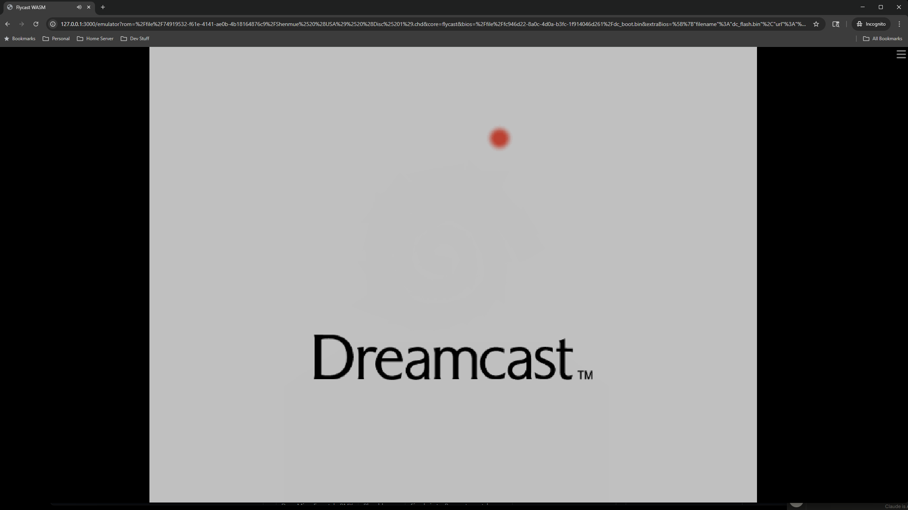
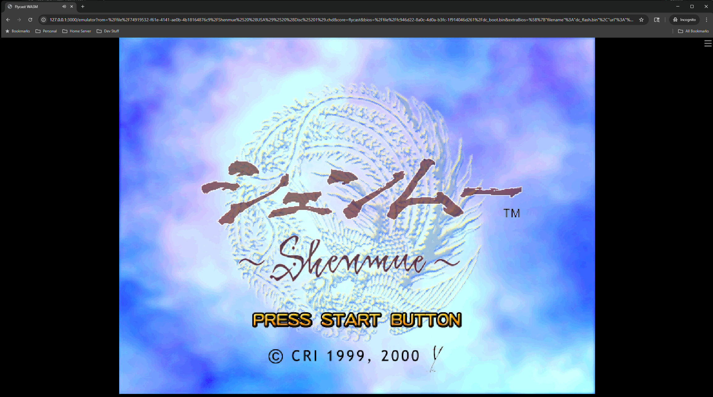

# Flycast WASM

**The first Sega Dreamcast emulator that runs in a browser, powered by the
first SH4 to WebAssembly JIT recompiler. Native performance.**

<p align="center">
  
  
  
</p>

This repository contains a working WebAssembly build of
[flyinghead/flycast](https://github.com/flyinghead/flycast) as a libretro core,
plus the custom dynamic recompiler that makes it fast. Download the core, load
it in an EmulatorJS-style frontend with your own legally dumped BIOS and game
images, and Dreamcast games run in a browser tab. Heavy 3D titles hold a locked
60fps with clean audio.

Nobody had done this before. The upstream maintainer
[explicitly declined WASM support](https://github.com/flyinghead/flycast/issues/1883).
EmulatorJS doesn't list Dreamcast as a supported system. The libretro buildbot
produces no Flycast WASM core. The received wisdom was that a fast Dreamcast in
the browser wasn't possible, because WebAssembly forbids the self-modifying
code that every dynarec depends on. Turns out it is possible. This is it.

## What was built

- **The port** (February 2026): upstream flycast compiled to WebAssembly with
  Emscripten and CMake, running as a libretro core with WebGL2 rendering. On
  the interpreter it booted and played at a couple of FPS. Proof of life, not
  a product.
- **The JIT** (March through August 2026): a from-scratch SH4 to WASM dynamic
  recompiler. SH4 machine code is decoded to Flycast's SHIL IR, compiled to
  WebAssembly bytecode in the browser at runtime, instantiated via
  `WebAssembly.compile`, and dispatched through `call_indirect` from a C
  dispatch loop. No JavaScript in the hot path. 62 of 70 SHIL ops emit native
  wasm. Registers are cached in wasm locals. Hot code gets fused into
  multi-block modules.
- **The hard parts**: self-modifying-code detection via page generations
  (eliminated 98% of runtime hashing), inline fast paths for guest memory
  access (import crossings cut from roughly 500K per frame to 9K, which was
  the single biggest wall), a guest-time-debt frame pacer, compile storm
  management, and an AudioWorklet ring with tempo-based rate control.
- **The validation methodology**: every subsystem was certified against the
  unmodified reference interpreter through differential test harnesses.
  Hundreds of thousands of block-level comparisons at zero divergence, instead
  of playing games and hoping. If you ever want to build a correct JIT solo,
  this methodology is probably the most reusable thing here.
- **The result**: from about 2 FPS to a locked 60fps at native resolution with
  clean audio in the heaviest titles tested.

## How it works

```
SH4 machine code -> Flycast decoder -> SHIL IR -> wasm bytecode emitter
        -> WebAssembly.compile -> function table -> call_indirect dispatch
                     (C dispatch loop, no JS in the hot path)
```

The full story lives in **[TECHNICAL_WRITEUP.md](TECHNICAL_WRITEUP.md)**:
architecture, every performance wall in the order it fell, the measured
numbers, and the differential validation methodology. If you're here to learn
how to build one of these, start there.

## Using the core

The release ships the built core (`flycast_libretro.js` plus `.wasm`) and its
configuration. It runs in any EmulatorJS-style libretro web frontend:

1. Serve the core files alongside your frontend. The server must send
   cross-origin isolation headers (`Cross-Origin-Opener-Policy: same-origin`
   and `Cross-Origin-Embedder-Policy: require-corp`).
2. Register the core with your frontend. See `config/core.json` for the
   metadata and `config/dreamcast-core-options.json` for the tuned core
   options.
3. Supply your own legally dumped Dreamcast BIOS (`dc_boot.bin`,
   `dc_flash.bin`) and game images (CHD, CDI, GDI, or CUE). No BIOS or game
   content is included or hosted here, and none ever will be. This project is
   the emulator, nothing else.

## Building from source

Requires Linux or WSL2 with Emscripten SDK 3.1.74 or newer.

```bash
# Clone upstream flycast at the pinned commit
git clone https://github.com/flyinghead/flycast.git source
cd source && git checkout 2c48c01
git submodule update --init --recursive

# Apply the port + JIT patches (the canonical record of every modification)
git apply ../patches/wasm-jit-phase1-modified.patch

# Add the JIT sources
cp ../patches/rec_wasm.cpp ../patches/wasm_emit.h \
   ../patches/wasm_module_builder.h ../patches/fly_instrument.h core/rec-wasm/

# Build
cd .. && bash build-prod.sh    # production core (diagnostics stripped)
```

These steps are exactly what `build-prod.sh` documents in its header, and the
whole flow was verified from a fresh clone before release. The JIT source
files live in `patches/` verbatim: `rec_wasm.cpp` (dynarec, dispatch, SMC,
test harnesses), `wasm_emit.h` (SHIL to wasm op emitters),
`wasm_module_builder.h` (wasm binary encoder), and `fly_instrument.h`
(instrumentation used by dev builds).

## Project status. Read this if you want to contribute.

I built this to prove it could be done, and it's done: the JIT is certified
against the reference interpreter, performance is native-class, and the whole
approach is documented well enough to reproduce. I have a job and other
projects, so development here will be slower than the sprint that built it,
but the project is not parked. **Next on the roadmap: WinCE compatibility.**

If you want to contribute, two documents are your map:

- **[docs/WINCE_MMU_ROADMAP.md](docs/WINCE_MMU_ROADMAP.md)** covers the one
  big missing feature and the next thing I plan to build. Windows CE titles
  (Sega Rally 2 and friends) need full SH4 MMU support, which the JIT
  currently doesn't have. The document is a complete phased implementation
  plan with root cause analysis: what breaks, why, the go/no-go experiment
  to run first, and the fast-path design already proven by flycast's native
  backends. I'll be chipping away at it. If you want to help, or beat me to
  it, the plan is right there.
- **[TECHNICAL_WRITEUP.md](TECHNICAL_WRITEUP.md)**, the "Future work" section,
  lists everything planned but not done, with the research already written up:
  - **Region compilation**: whole-hot-page wasm modules with internal
    dispatch. Built and certified in-tree, dark behind flags. Needs a rollout
    soak, and the multi-region variant needs a churn breaker first.
  - **IndexedDB per-title bytecode cache** so second sessions boot pre-warmed.
    Caching compiled `Module` objects is impossible (browsers removed that),
    but caching the generated bytes is straightforward.
  - **FPU register caching**. Float registers still round-trip through
    context memory on every op. Measure first, then build.
  - **WASM branch hints**: already emitted on every guard slow path, dormant
    until Chrome's V8 enables consumption by default. Firefox ships it today.
  - **WebGPU renderer**: the path to per-pixel order-independent
    translucency, the last rendering-accuracy gap class.
  - A handful of known cosmetic issues, documented in the write-up.

Pull requests welcome. Anything that comes with differential-harness evidence
gets reviewed first.

## Credits

- **Flycast** by [flyinghead](https://github.com/flyinghead), the upstream
  emulator this is built on. All emulation correctness ultimately descends
  from that codebase and its reference interpreter.
- **WebAssembly port and SH4 to WASM JIT** by
  [Nick Somers](https://github.com/nasomers).
- **EmulatorJS**, the frontend ecosystem this core targets.

## License

[GPLv2](LICENSE), inherited from Flycast. Fork freely. Keep it open.
